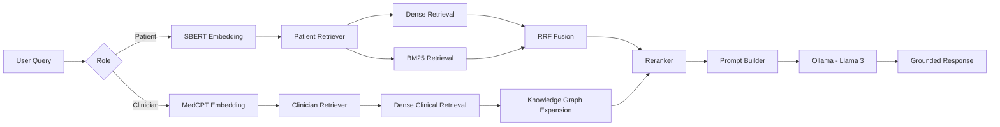

<!-- # Role-Aware Privacy-Isolated RAG System

A production-grade, locally-running RAG system with strict data isolation between patient and clinician data, dual embedding pipelines, and role-aware retrieval/generation.

## Architecture Overview

### Layers 1-5 Implementation

| Layer | Component | Description |
|-------|-----------|-------------|
| 1 | **Ingestion** | Separate pipelines for curated KB (PDFs) and user content (text files) |
| 2 | **Chunking + Embeddings** | Parent-child chunking with dual embedders (SBERT + MedCPT) |
| 3 | **Vector Storage** | FAISS indexes per collection (curated_sbert, curated_medcpt, user_{id}, clinician_{id}) |
| 4 | **Retrieval** | Role-based routing: Patient (SBERT + BM25 + RRF) / Clinician (MedCPT + KG expansion) |
| 5 | **Generation** | Local LLM with dual prompt system (supportive vs clinical tone) |

## Key Features

- **Strict Data Isolation**: Separate FAISS indexes per user/role - no metadata filtering
- **Dual Embedding Pipelines**: SBERT for patient/conversational, MedCPT for clinical/structured
- **Parent-Child Chunking**: Paragraph-level parents with sentence-overlap children
- **Role-Aware Retrieval**: 
  - Patient: Dense (SBERT) + Sparse (BM25) → RRF → Rerank
  - Clinician: Dense (MedCPT) + Knowledge Graph expansion → Rerank
- **Local-Only Execution**: No API calls, all models run locally via HuggingFace transformers

## Quick Start

### Installation

```bash
pip install -r requirements.txt
```

### Run Full Demo

```bash
python main.py
```

This will:
1. Create sample data (curated KB + patient journal + clinician notes)
2. Build all FAISS indexes
3. Run example queries for both roles
4. Show system stats

### Ingest Custom Data

```bash
# Add PDFs to data/curated_kb/
# Add patient text files to data/user_content/users/{user_id}/
# Add clinician text files to data/user_content/clinicians/{clinician_id}/

python scripts/ingest.py
```

### Query the System

```bash
# Patient query
python scripts/query.py "I've been feeling depressed lately" --role patient --user-id patient_001

# Clinician query
python scripts/query.py "DSM-5 criteria for MDD" --role clinician --user-id clinician_001
```

## Project Structure

```
src/
├── ingestion/          # Layer 1: Document parsing
│   ├── base.py         # Base parser classes
│   ├── curated_kb.py   # PDF ingestion (Docling-style + PyMuPDF fallback)
│   └── user_content.py # User/clinician text file ingestion
├── chunking/           # Layer 2: Parent-child chunking
├── embeddings/         # Layer 2: Dual embedders (SBERT + MedCPT)
├── vectorstore/        # Layer 3: FAISS index management
├── retrieval/          # Layer 4: Role-based retrieval + RRF + KG expansion
├── reranker/           # Layer 4: Cross-encoder / lightweight reranking
├── generation/         # Layer 5: Local LLM + dual prompt system
├── pipeline/           # End-to-end orchestration
└── utils/              # Config, logging

scripts/
├── ingest.py           # Build indexes from data/
└── query.py            # CLI for querying

configs/
└── config.yaml         # All configuration

data/
├── curated_kb/         # PDFs for knowledge base
└── user_content/
    ├── users/          # Patient private data
    └── clinicians/     # Clinician private data
```

## Data Isolation Guarantees

```
┌─────────────────────────────────────────────────────────────┐
│                     PATIENT PATH                            │
├─────────────────────────────────────────────────────────────┤
│ Query → SBERT Embedding → curated_kb_sbert.index            │
│                ↓                                            │
│          BM25 on curated KB                                 │
│                ↓                                            │
│          RRF Fusion → Rerank → Patient Prompt → Generation  │
│                ↓                                            │
│          user_{id}_private.index (SBERT)                    │
└─────────────────────────────────────────────────────────────┘

┌─────────────────────────────────────────────────────────────┐
│                    CLINICIAN PATH                           │
├─────────────────────────────────────────────────────────────┤
│ Query → MedCPT Embedding → curated_kb_medcpt.index          │
│                ↓                                            │
│          KG Expansion (medical synonyms)                    │
│                ↓                                            │
│          Combined → Rerank → Clinician Prompt → Generation  │
│                ↓                                            │
│          clinician_{id}_private.index (MedCPT)              │
└─────────────────────────────────────────────────────────────┘
```

**Critical**: Patient and clinician data NEVER share indexes. No cross-contamination possible.

## Configuration

All settings in `configs/config.yaml`:

- Model names and parameters
- Chunking sizes (parent/child/overlap)
- Retrieval parameters (top-k, RRF k, etc.)
- Vector store paths
- Logging levels

## Models Used (All Local)

| Purpose | Model | Size |
|---------|-------|------|
| Patient Embeddings | `sentence-transformers/all-MiniLM-L6-v2` | ~80MB |
| Clinical Embeddings | `ncbi/MedCPT-Article-Encoder` | ~500MB |
| Reranking | `BAAI/bge-reranker-base` | ~300MB |
| Generation | `microsoft/phi-2` | ~1.5GB |

First run downloads models to HF cache (~2.4GB total).

## Extending the System

### Add New Embedder
```python
# src/embeddings/embedder.py
class MyEmbedder(BaseEmbedder):
    def embed(self, texts): ...
    def embed_query(self, query): ...

# Register in get_embedder()
```

### Add New Retrieval Strategy
```python
# src/retrieval/retriever.py
class MyRetriever:
    def retrieve(self, query, user_id): ...

# Wire into RAGPipeline
```

### Swap Generator
```python
# src/generation/generator.py
class MyGenerator(BaseGenerator):
    def generate(self, prompt): ...
    def generate_with_context(self, query, context, role): ...

# Use: get_generator("my_generator")
```

## Requirements

- Python 3.10+
- 8GB+ RAM (for local models)
- CPU-only (no GPU required, but faster with CUDA)

## License

MIT -->


Role-Aware Graph-Enhanced Retrieval-Augmented Generation for Mental Health Assistance
> **EMNLP Reproducibility Repository**
Overview
This repository contains a modular Retrieval-Augmented Generation (RAG) system for mental-health assistance featuring role-aware retrieval, graph-enhanced retrieval, privacy-isolated vector stores, dual embedding models, Cross-Encoder reranking, and local LLM generation using Ollama.
Key Features
Role-aware retrieval (Patient / Clinician)
Privacy-isolated FAISS indexes
Dual embeddings (SBERT + MedCPT)
Graph-enhanced retrieval
Cross-Encoder reranking
Parent-child chunking
Local LLM inference (Ollama / Llama 3)
End-to-end evaluation
Ablation framework
Repository Structure
```text
configs/
data/
evaluation/
scripts/
src/
requirements.txt
README.md
```
# 🏗️ System Architecture

The proposed system follows a modular **5-layer Retrieval-Augmented Generation (RAG)** architecture designed for privacy-preserving mental health assistance. Separate retrieval pipelines are maintained for **patients** and **clinicians**, while both share a curated mental-health knowledge base.



---

# 📚 Layered Architecture

| Layer | Module | Description |
|--------|--------|-------------|
| **Layer 1** | Document Ingestion | Parses curated PDFs and user-specific documents into a unified internal representation. |
| **Layer 2** | Chunking & Embedding | Parent-child chunking followed by SBERT (patient) or MedCPT (clinician) embeddings. |
| **Layer 3** | Vector Storage | Privacy-isolated FAISS indexes for curated knowledge, patient memory and clinician memory. |
| **Layer 4** | Retrieval | Role-aware retrieval using Dense Search, BM25, Reciprocal Rank Fusion (RRF), Knowledge Graph Expansion and Cross-Encoder reranking. |
| **Layer 5** | Generation | Context-aware prompt construction followed by local LLM generation using Ollama (Llama 3). |

---

# 🔀 Retrieval Pipelines

## 👤 Patient Pipeline

```text
Patient Question
        │
        ▼
 SBERT Embedding
        │
        ▼
 Dense Retrieval ─────┐
                      │
 BM25 Retrieval ──────┤
                      ▼
        Reciprocal Rank Fusion
                      │
                      ▼
      Lightweight / CrossEncoder
             Reranking
                      │
                      ▼
      Patient Prompt Builder
                      │
                      ▼
        Ollama (Llama 3)
                      │
                      ▼
     Evidence-Grounded Answer
```

---

## 👨‍⚕️ Clinician Pipeline

```text
Clinical Query
      │
      ▼
 MedCPT Embedding
      │
      ▼
 Clinical Dense Retrieval
      │
      ▼
 Knowledge Graph Expansion
      │
      ▼
 CrossEncoder Reranking
      │
      ▼
 Clinical Prompt Builder
      │
      ▼
   Ollama (Llama 3)
      │
      ▼
 Clinical Response
```

---

# 🔒 Privacy Isolation

The system enforces strict data isolation by maintaining independent FAISS indexes.

```text
Curated Knowledge Base
│
├── curated_kb_sbert.index
│
└── curated_kb_medcpt.index


Patient Data
│
├── user_001_private.index
├── user_002_private.index
└── ...


Clinician Data
│
├── clinician_001_private.index
├── clinician_002_private.index
└── ...
```

No patient embeddings are stored inside clinician indexes, and clinician-specific information is never retrieved for patient queries.

---

# 🧠 Core Components

| Component | Implementation |
|-----------|----------------|
| Chunking | Parent-Child Chunking |
| Dense Retrieval | FAISS |
| Sparse Retrieval | BM25 |
| Fusion | Reciprocal Rank Fusion (RRF) |
| Graph Retrieval | Knowledge Graph Expansion |
| Patient Embedding | SBERT |
| Clinical Embedding | MedCPT |
| Reranker | BAAI/bge-reranker-base |
| Generator | Ollama (Llama 3) |
| Framework | PyTorch + Hugging Face |

The Hugging Face models download automatically on first use. Install the generator separately:
```bash
ollama pull llama3
```
Installation
```bash
git clone <repo>
cd <repo>
python -m venv .venv
source .venv/bin/activate
pip install -r requirements.txt
```
Datasets
CounselChat (patient evaluation)
Curated clinician benchmark (corpus-aligned evaluation)
Place datasets under `evaluation/data/`.
Build Knowledge Base
```bash
python scripts/ingest.py
```
Run Queries
Patient:
```bash
python scripts/query.py --role patient --user-id patient_001 --query "I feel anxious."
```
Clinician:
```bash
python scripts/query.py --role clinician --user-id clinician_001 --query "DSM-5 criteria for MDD"
```
Evaluation
```bash
python -m evaluation.run_evaluation
```
Ablation
```bash
python -m evaluation.run_ablation
```
Experiments:
Dense
Graph
Role-Aware
Full
Outputs are written to `evaluation/results/`.
Configuration
All runtime settings are in `configs/config.yaml`.
Hardware
Experiments were performed on CUDA-enabled NVIDIA GPUs (Tesla V100 / A100 class). CPU execution is supported but slower.
Troubleshooting
Verify CUDA:
```bash
python -c "import torch; print(torch.cuda.is_available())"
```
Verify Ollama:
```bash
ollama ps
```
Citation
```bibtex
@inproceedings{yourpaper2026,
  title={Role-Aware Graph-Enhanced Retrieval-Augmented Generation for Mental Health Assistance},
  author={Author(s)},
  booktitle={Proceedings of EMNLP},
  year={2026}
}
```
License
MIT
